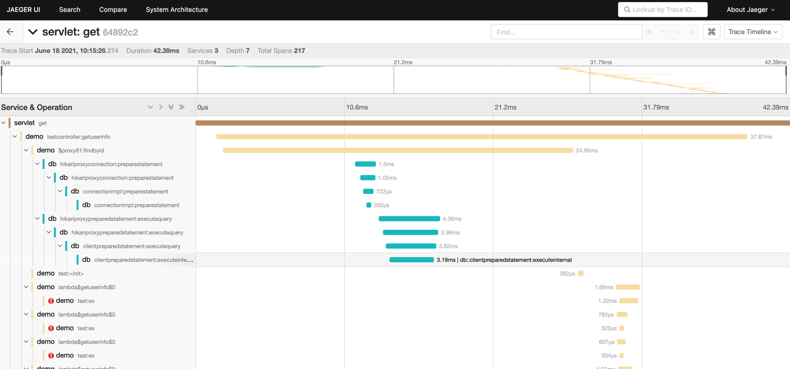

# PVisual

性能可视化分析器，可配合Zipkin或者Jaeger实现性能可视化展示。


* 采用无侵入模式，支持agent和attach
* 可快速二次快速开发，实现自主业务关键点追踪
* 融合TTL支持线程间依赖维护，自动维护跨线程上下文传递 https://github.com/alibaba/transmittable-thread-local
* 基于魔改版jvm-sandbox https://github.com/tmtbe/jvm-sandbox

# 开发示例
* 同步场景的开发示例
```java
public class HttpServletWatch extends PWatch {
    protected Method getMethod;

    public HttpServletWatch() throws PTraceException {
    }

    @Override
    protected WatchConfig createWatchConfig() {
        return WatchConfig.builder()
                .canCreateTrace(true)
                .serviceName("Servlet")
                .className("javax.servlet.http.HttpServlet")
                .behaviorName("service")
                .patternType(EventWatchBuilder.PatternType.REGEX)
                .buildingForBehavior((t) -> t.withAccess(Modifier.PROTECTED)
                        .withParameterTypes("javax.servlet.http.HttpServletRequest", "javax.servlet.http.HttpServletResponse"))
                .buildingForClass((t) -> {
                })
                .build();
    }

    @Override
    protected void checking(ClassLoader classLoader) throws Throwable {
        Class<?> httpServletRequestClass = getBusinessClass("javax.servlet.http.HttpServletRequest", classLoader);
        getMethod = httpServletRequestClass.getDeclaredMethod("getMethod");
    }


    @Override
    protected void before(Advice advice) throws Throwable {
        startSpan(advice, span -> {
            span.kind(Span.Kind.SERVER);
            span.name((String) getMethod.invoke(advice.getParameterArray()[0]));
            addStackTrace(span);
        });
    }
}
```

这是一个Http Servlet的监控，可以看到开发起来非常简单，只需要描述追踪的目标和增加追踪的数据即可。

* 异步场景的开发示例

```java
public class NettyHttpWatch extends PWatch {
    public NettyHttpWatch() throws PTraceException {
    }

    @Override
    protected WatchConfig createWatchConfig() {
        return WatchConfig.builder()
                .serviceName("netty")
                .className("reactor.netty.ConnectionObserver")
                .behaviorName("onStateChange")
                .canCreateTrace(true)
                .build();
    }

    @Override
    protected void checking(ClassLoader classLoader) throws Throwable {

    }

    @Override
    protected void before(Advice advice) throws Throwable {
        Connection connection = (Connection) advice.getParameterArray()[0];
        ConnectionObserver.State newState = (ConnectionObserver.State) advice.getParameterArray()[1];
        if (newState == HttpServerState.REQUEST_RECEIVED) {
            startSpanWithAsync(advice, connection, null);
        } else if (newState == HttpServerState.DISCONNECTING) {
            finishSpanWithAsync(advice, connection, null);
        }
    }

    @Override
    protected void after(Advice advice) throws Throwable {

    }
}
```

这是Netty的Http监控。

* WebFlux的支持

查看SubscriberInitWatch和SubscriberOnNextWatch例子。